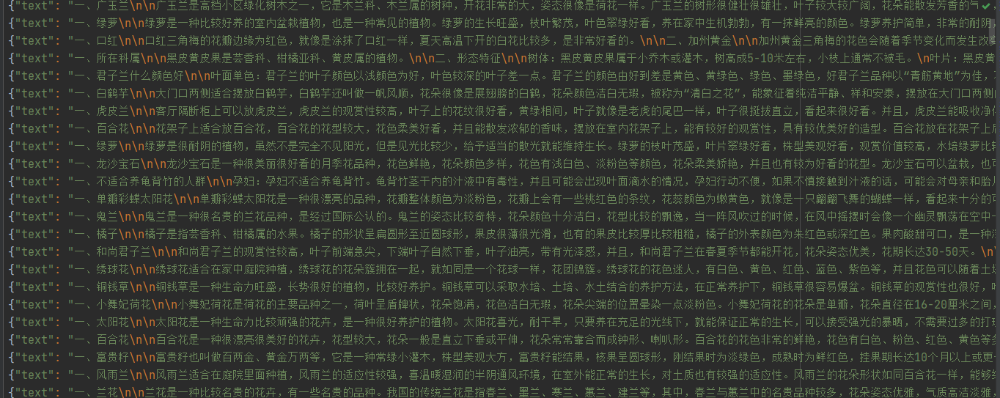

# PlantFlowerDatasets
植物花卉数据集[PlantFlower Datasets]基于RWKV大模型RWKV World模型数据集


### 数据说明

   

> 盆栽花卉植物栽培等语料数据集,涵盖了养护，种植，生长，形态，花语，养护知识，养护问答等丰富的语料数据

1. data文件夹[PlantFlower-20230621.jsonl]中文语料均清洗为支持RWKV Word模型的 jsonl格式
2. ~~PlantFlower-20230621.jsonl数据只归纳了5010条数据，后续时间会陆续增加数据集~~
3. PlantFlower-20230621.jsonl数据归纳了5100条数据[增加了90条]，后续时间会陆续增加数据集
4. 增加了数据集binidx文件，可用于直接训练，会更有利于训练


### 演示


1. 展示部门数据




## 引用

如果你觉得我们的工作有帮助的话，请考虑引用下列论文

```
@article{PlantFlower Datasets,
  title={PlantFlowerDatasets: An open rwkv mode datasets},
  author={lovebull,Fengchun[Spring] Xu},
  year={2023}
}

```
