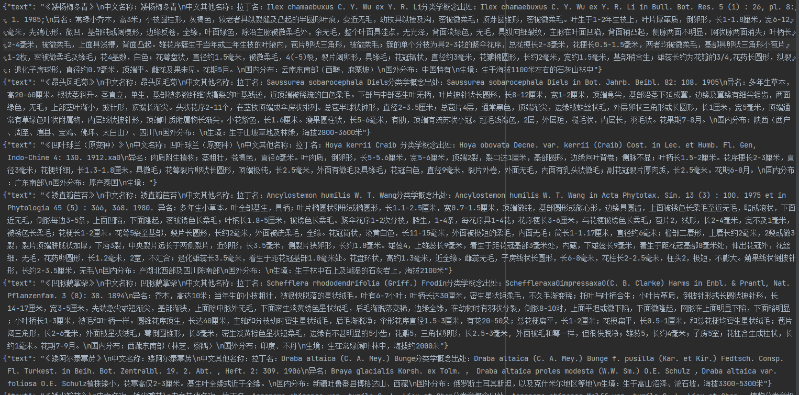

# PlantFlowerDatasets
植物花卉数据集[PlantFlower Datasets]基于RWKV大模型RWKV World模型数据集


### 数据说明

   

> 盆栽花卉植物栽培等语料数据集,涵盖了养护，种植，生长，形态，花语，养护知识，养护问答等丰富的语料数据

1. data文件夹[PlantFlower-20230621.jsonl]中文语料均清洗为支持RWKV Word模型的 jsonl格式
2. ~~PlantFlower-20230621.jsonl数据只归纳了5010条数据，后续时间会陆续增加数据集~~
3. PlantFlower-20230621.jsonl数据归纳了5100条数据[增加了90条]，后续时间会陆续增加数据集
4. 增加了数据集binidx文件，可用于直接训练，会更有利于训练
5. 新增中国植物志数据集 共有30993条数据 ，文件大小62MB
6. 新增植物花卉+中国植物志合订本数据集 共有数据36033条，文件大小 70MB


### 演示


1. 展示部门数据


------

# 中国植物数据集

中国植物志数据集数据30993条

在此把数据转换为binidx文件,方便RWKV的炼丹师使用

数据展示截图所示  [数据存放再data目录下两个文件 cnflora_data_text_document.bin，cnflora_data_text_document.idx ]

 cnflora_data_text_document.bin

 cnflora_data_text_document.idx




> 中国是全球植物多样性最丰富的国家之一，全球36个热点地区主要或部分在我国境内的有四个。在一穷二白的基础上，经全国312位作者和164位绘图人员45年的努力，《中国植物志》自1959年开始出版，在2004年全部完成，记载了301科3408属31142种植物的科学名称、形态特征、生态环境、地理分布、经济用途和物候期等。《中国植物志》的英文修订版（Flora of China）在《中国植物志》的基础上，增补了新类群和新资料，进行了分类修订，并在2013年完成，记载了312科3328属31362种植物 。《中国植物志》 和“Flora of China”是目前世界上最大型、记录植物种类最多的植物志，它为有效保护和合理利用我国的植物资源提供了极为重要的基础信息和科学依据。
>
> 近年来，基于分子系统学研究结果，维管植物科属范畴发生了很大的变动。根据目前初步统计，《中国植物志》收录的142 科的分类地位和范畴发生了变动，占总数的47. 3%，“Flora of China”则有73 科发生了变动；而属方面变化也比较多，如1999年《中国植物志》记载中国兰科植物172个属, 到2018年约有60个属的界定发生了变化。随着野外工作的开展和研究的深入, 大量来自或分布于中国的植物新物种被发现和发表，如1998年《中国植物志》豆科部分记载豆科植物1485种，2015年则增加到1865种（《中国生物物种名录》第1卷被子植物IV）；而在“Flora of China”出版后的2013-2018年，来自或分布于中国的植物新物种达1038个。
>
> 为方便了解和使用中国维管植物的多样性信息，及时反映广为接受的分类学研究成果，在中国科学院先导项目地球大数据科学工程的支持下（XDA19050201），我们开展在线中国植物志建设工作，收集、汇总、整理整合中国维管植物的多样性信息，并以植物志的形式进行查阅。


------

# 植物盆栽花卉+中国植物志 合订本数据集

 共有数据36033条数据，现已转换为bin,idx文件 70MB

plantflower_cnflora_data_text_document.bin

plantflower_cnflora_data_text_document.idx


------


## RWKV-LM-LoRA[World模型]训练文件

World模型LoRA微调后进行的推理，查看微调后的模型是否正常

文件夹里面内容直接粘贴到目标文件夹

```
执行 RWKV_JIT_ON=1 python chat_word.py
```


## 引用

如果你觉得我们的工作有帮助的话，请考虑引用下列论文

```
@article{PlantFlower Datasets,
  title={PlantFlowerDatasets: An open rwkv mode datasets},
  author={lovebull,Fengchun[Spring] Xu},
  year={2023}
}

```
